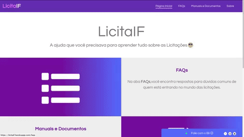
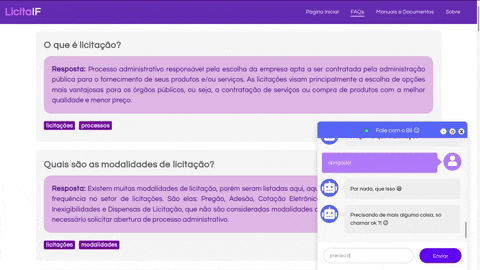

# LicitaIF

Aplicação desenvolvida como trabalho final do curso [Chatbots: da Teoria ao Deploy, com IBM Watson](https://github.com/jpdik/curso-chatbots-ibm), preparado para o projeto de extensão Laboratório de Redes de Conhecimento, realizado no Instituto Federal do Sudeste de Minas Gerais - *Campus* Barbacena.

O intuito da aplicação é auxiliar servidores do IF com Licitações, meio de efetuar compras e contratações de serviços para o Instituto.

> Na página inicial, o usuário encontra informações sobre as funcionalidades da aplicação.

> Na página FAQs, o usuário tema acesso as perguntas mais frequentes (FAQS) do site.

>Na página Manuais e Documentos, estão disponíveis para download modelos de documentação além de manuais sobre as licitações e funcionamento do setor de licitações da Instituição.

>A aplicação contém ainda um chatbot para ajudar o usuário com dúvidas sobre processos licitatórios, documentações, o setor de licitações ou as licitações em si.

> O chatbot também fornece modelos para documentos utilizados no Instituto.

## Testando

Para testar a aplicação, acesso o site [LicitaIF](https://licitaif.herokuapp.com/).

